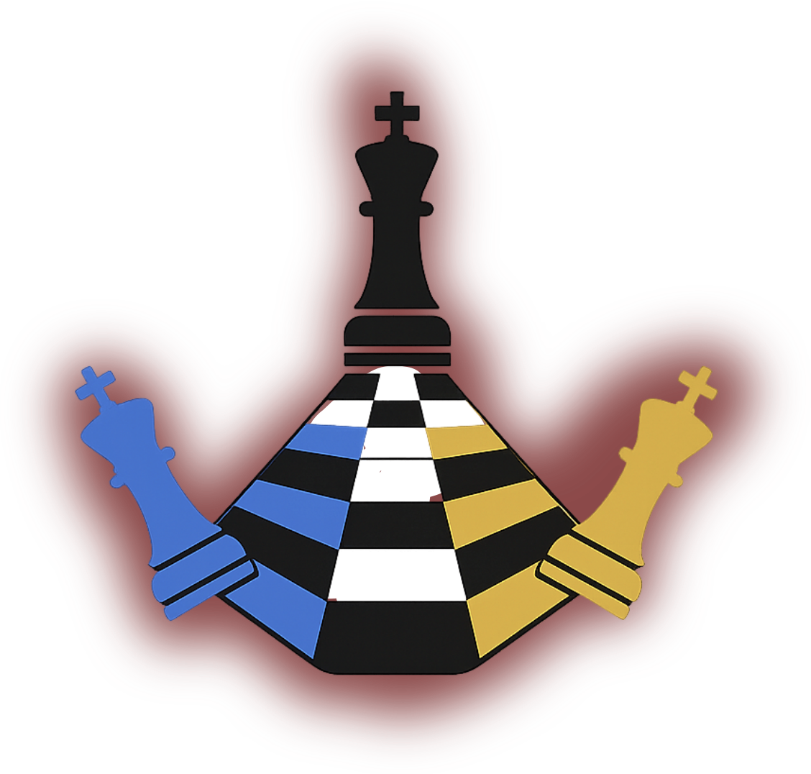

<p align="center">
  
</p>


<h1 align="center">Triple Chess 24x8 ♚♔</h1>

<p align="center">
  <strong>Ajedrez triple en un tablero de 24×8.</strong>
  <br />
  Tres reinos, tres reyes por bando, un solo objetivo: la victoria.
</p>

---

## ¿Qué es esto?

Un experimento personal que fusiona la estrategia clásica del ajedrez con un tablero triple de 24 columnas por 8 filas. Cada jugador controla **tres reyes**, tres juegos de piezas estándar y debe decidir cómo coordinarlos para atacar y defender simultáneamente.

Como el **Sudoku**,(lógica combinatoria espaciotemporal) exige mirar desde múltiples perspectivas a la vez: cada movimiento repercute en los tres frentes, y la lectura constante del tablero es clave para anticipar al oponente.

## Modos de juego

- **Jugador vs IA** — Enfréntate a un motor basado en minimax con poda alfa-beta.
- **IA vs IA** — Siéntate a observar cómo dos motores compiten entre sí.

## Reglas de victoria

| Regla | Descripción |
|---|---|
| **1.er Rey Cae** | Muerte súbita: el primero que pierde un rey, pierde la partida. |
| **Todos los Reyes** | Hay que capturar los tres reyes enemigos para ganar. |
| **Caza de Reyes** | Sin jaques ni mates. Gana quien capture más reyes. |

PRUEBA LA APP EN https://triplechess.web.app/

## Cómo ejecutar

```bash
npm install
npm run dev          # Modo web (Vite)
npm run build        # Build para producción
npm run electron:dev # Modo escritorio (Electron)
```

## Tecnologías

React 19, TypeScript, Tailwind CSS 4, Vite, Motion, Electron.

## Despliegue en Firebase (manual, archivos locales)

```bash
# 1. Crear firebase.json y .firebaserc (no se suben a git)
firebase init hosting
#   - Directorio público: dist
#   - SPA: sí
#   - Reescribir todo a index.html: sí

# 2. Configurar Firebase SDK en src/firebase.ts (local, no se sube)

# 3. Build y deploy
npm run build
firebase deploy
```

---

<p align="center">
  <sub>Experimento creado por <a href="https://github.com/ElalChico">Elal Chico</a></sub>
  <br />
  <sub>¿Jugamos? 🏆</sub>
</p>
